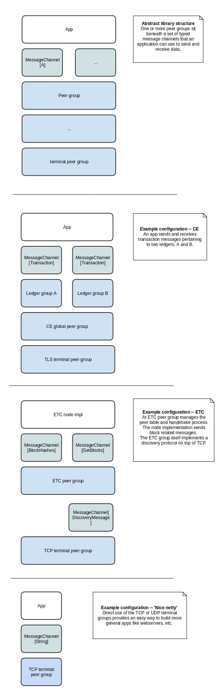

# CI status
[](https://circleci.com/gh/input-output-hk/scalanet)

# scalanet

### Summary

Scalanet is an asynchronous, strongly typed, resource-managed networking library, written in Scala with support for a variety of network technologies.
What does all that mean?
 * Resource managed. Scalanet makes it as easy as possible to send and receive messages without having to open or close connections.
 * Asynchronous. Scalanet is non-blocking. In this regard, it is like netty, however, unlike netty, Scalanet uses *reactive*
 programming idioms. 
 * Strongly typed. The library can translate binary data to and from case classes through the use of our codec library, [decco](https://github.com/input-output-hk/decco.git). If you have used libraries like [circe](https://github.com/circe/circe) or other libraries that derive typeclasses with shapeless, decco works in the same way.
 * Technology support. Out of the box, Scalanet supports TCP and UDP (with other internet and non-internet technologies to come) but through an abstraction called the _Peer Group_, allows for the addition of other transports or more complex p2p overlays (kademlia, ethereum, etc). The _Peer Group_ provides a consistent interface whatever your networking approach.   

It is well suited to peer-to-peer apps but supports client-server too.

### Peer groups
As mentioned, the foundation of Scalanet is the notion of a _Peer Group_. From a practical standpoint, a peer group 
allows an application to use a variety of network technologies with a consistent interface. More abstractly, it defines 
* an address space and 
* a context in which communication can happen.
* TODO: quality of service

A Peer Group could be something like scalanet's `UDPPeerGroup` where the addresses are IP:port combos and the set of 
peers allowed to communicate is basically anybody on the IP network in question (the internet, an office network, etc).
Equally, a Peer Group could be something like an Ethereum network where addresses are public keys and the peers
are anybody who talks the RLPx protocol. Equally, a peer group could be an integration test with the address space {Alice, Bob, Charlie}
and the peers are all in the same JVM. Scalanet will not limit you in this regard. 

Peer groups can implement arbitrary enrolment and encryption schemes, so are suitable for implementing secure messaging overlays.
Typically, on the internet, limiting the context of communication (aka _zoning_) is performed by firewalls. The idea
is so ubiquitous that it may not have struck you that this is a hack. Peer groups are designed to support more elegant
solutions, generally using cryptography instead of firewall provisioning.
 
### Structure of the library
Here is a picture of the structure of the library for a few sample applications:


### Getting started
The easiest way to get started is to send and receive data over TCP, using the library just like netty. Have a look at
the [TCPPeerGroupSpec](core/io/iohk/scalanet/test/peergroup/TCPPeerGroupSpec.scala) test case or the following code. 

```scala
// import some peer group classes
import io.iohk.scalanet.peergroup._

// message sending can be controlled using either
// monix, cat-effect, cats EitherT or scala Futures
// depending on your taste.
import io.iohk.scalanet.peergroup.future._
import scala.concurrent.Future

import java.net.InetSocketAddress
import java.nio.ByteBuffer

val config = TCPPeerGroup.Config(new InetSocketAddress(???))

val tcp = TCPPeerGroup.createOrThrow(config)

// send a message
val messageF: Future[Unit] = tcp.sendMessage(new InetSocketAddress("example.com", 80), ByteBuffer.wrap("Hello!".getBytes))

// receive messages
tcp.messageStream.foreach((b: ByteBuffer) => ())
 
``` 

# Contributing

### Branches

Two main branches are maintained: `develop` and `master`. 
`master` contains the latest stable version of the library. 
`develop` is the place you want to merge to if submitting PRs.

### Building the codebase

To build the codebase, we use [mill](http://www.lihaoyi.com/mill). Assuming you have mill installed correctly, you can build and test the codebase with
```bash
mill __.test
```

### Formatting the codebase
In order to keep the code format consistent, we use scalafmt.
 
The CI build will fail if code is not formatted, but the project contains a githook that means you do not have to think
about. To set this up:
- Install [coursier](https://github.com/coursier/coursier#command-line), the `coursier` command must work.
- `./install-scalafmt.sh` (might require sudo).
- `cp pre-commit .git/hooks/pre-commit`

### Reporting problems
You can also create issues in github at https://github.com/input-output-hk/scalanet/issues.
